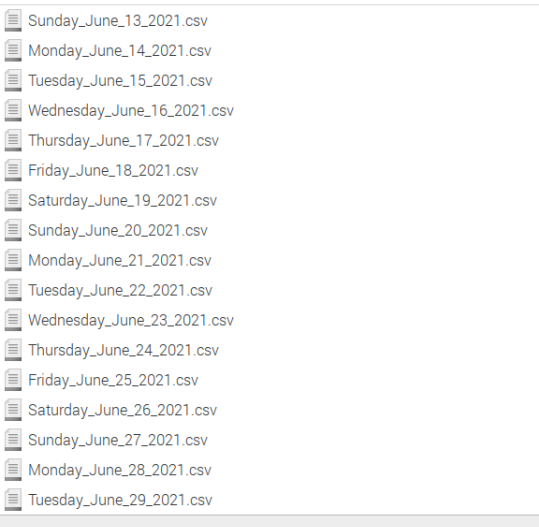
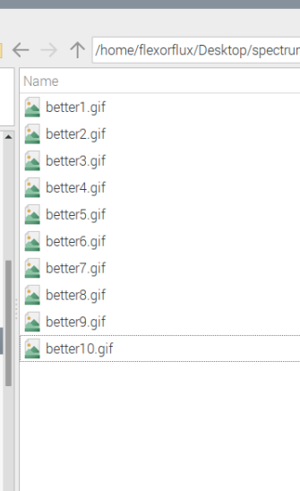
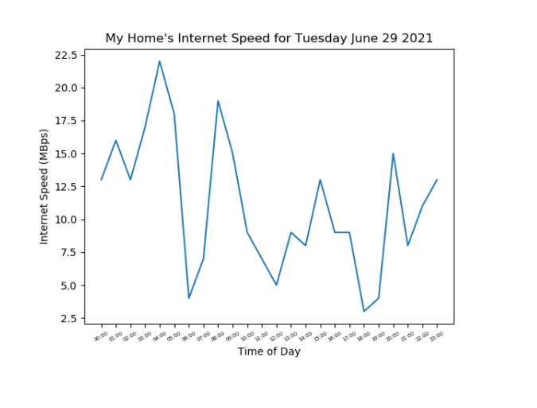

# Spectrum Checker


## Introduction
This is a python script created for a local Raspberry Pi I have on my local home network that runs a speed network test against my Internet Service Provider, Spectrum on an hourly basis, and posting the results online to a Twitter Account with a humorous gif.

To view the Twitter account please visit here: [@flexorflux](https://twitter.com/flexorflux)


----
## What's under the hood

This script utilizes the following:

- [Tweepy](https://www.tweepy.org/): For utilizing the Twitter API to post memes and my messages to Spectrum
- [OOKLA's speedtest CLI For Linux](https://www.speedtest.net/apps/cli): For conducting the hourly speedtests
- Pandas/Matloblib for the Data visualization 

## Backstory: Why I made this

My reasons for making this Python script are as follows:
- I always wanted to learn how to use the Twitter API
- I wanted to write a python script to run on my local Raspberry Pi Server
- I am super paranoid about my internet speed (I think the bill is overpriced)

And the most important reason (Please bare with me as I describe further):
- Spectrum sent out a field tech to install a new coaxial line for my neighbor under their request. Instead of adding a new line into the Tap that is outside our conjoined homes, the field tech took the liberty of SPLICING my line that goes into my home and into my modem, and essentially splitting the bandwidth from my line into my neighbors home. The field tech was essentially too lazy or busy to climb the house to add the new line. I get it, during the Covid-19 Pandemic it is a bit crazy and things were tough in 2020, but I was paying 79.99 a month for internet at a time while I was not working due to my employer having to lay me off. Then comes Spectrum having to ruin it more and essentially cut down my internet speed in half. So I did the most reasonable thing I could do, I called Spectrum asking them to send another tech out to fix it. They said no. 

- Once Spectrum said no for unknown reasons, I decided to take matter into my own hands. I went out to MicroCenter and purchased a 50 foot coaxial cable line and then with my step father climbed up my two story home (having to break our backyard awning on the second floor porch because it was the only way to safely get up to the roof.) I ended up installing an entirely new line myself by plugging in the wire into the Tap on the roof, routing the wire back down into my room on the first floor through the brick outer wall and into the other end of a ethernet jack that I installed in my room, and then from the jack right into my purchased personal modem (because I am not going to pay for a vendor rental fee for a modem)

- Having to do this was nerve wrecking, frustrating, and exhausting. I am not keen on heights and also was afraid I might damage something on the tap outside due to the wires having to be grounded so I was afraid I could shocked by some random possible shortage. So in response to having to do this all MYSELF to bring my internet speed up to my expected speeds that I was paying for I decided the following. I decided to learn how to use the Twitter API and essentially create a bot that posts every hour how fast my internet speed was and tag Spectrum on it, and then at the end of the day, it will collect the daily results and create a graph displaying for the whole world to see how my internet was for the day. Take that Spectrum. 


## TL;DR

Due my Internet Service Provider not being to provide assistance in correcting an oversight accomplished by one of their employees, I took matters in my own hands and fixed my home's internet so that I can expect to get what I am paying for. As a result I decided to learn how to use the Twitter API to rub it in Spectrum's face and blast them about my internet speed every hour of every day and post the results on Twitter as payback.

## A Break Down Of What Happens 

For context, at my home I have a Raspberry Pi running as a DNS server, so I have the Raspberry Pi also hosting the Python Script and having it run via a cron job.


How the script runs is as follows:

1 - A Local CSV file is created.



2 - Using the speedtest cli a speedtest on the Pi runs and the data is collected and appended to the csv file

`bashOutput = check_output(['/usr/bin/speedtest', '-s', '16888', '-f', 'csv'])`

3 - The results also pass through a logic (if else statement) where depending on the resulting speed in MegaBytes Per Second (MBps) , a specific type of meme gif from a pool of local gif files will be used with a corresponding message. The ranges are split into 3:

    - From 0 to 20 Mbps = A mean message to Spectrum with an angry Gif
    - From 20 to 40 MBps = A passive aggressive message with a calmer gif
    - From 40 MBps and above = A really happy message with a positive Gif!

```python
if downloadSpeed >= 40:
    tweet = "Nice job #Spectrum! My internet speed is at {}MBps, you guys are awesome!".format(downloadSpeed)
    media = api.media_upload("/home/flexorflux/Desktop/spectrumChecker/images/hellyea/hellyea{}.gif".format(fileNumber))
    api.update_status(status=tweet, media_ids=[media.media_id])
  elif downloadSpeed in range(20, 40):
    tweet = "I guess it's decent #Spectrum, my internet could be a tad better though since it's at {}MBps".format(downloadSpeed)
    media = api.media_upload("/home/flexorflux/Desktop/spectrumChecker/images/couldBeBetter/better{}.gif".format(fileNumber))
    api.update_status(status=tweet, media_ids=[media.media_id])
  else:
    tweet = "#Spectrum? wtf is going on with my internet? it's at {}MBps...".format(downloadSpeed)
    media = api.media_upload("/home/flexorflux/Desktop/spectrumChecker/images/wtf/wtf{}.gif".format(fileNumber))
    api.update_status(status=tweet, media_ids=[media.media_id])
```



> To clarify, 1 MBps is not equal to 1 Mbps. The former is MegaBytes and the other is Mega Bits per second.

4 - This process will run every hour and then at precisely 2300 hours/11:00PM, the script will run for the last time for the day by posting a graph of all the results of that day using Pandas and MatPlotlib!



_Take that Spectrum._